# 💊 PharmaStock Manager

**PharmaStock Manager** is a simple and efficient web-based application built using **HTML, CSS, JavaScript, PHP, and MySQL**. It helps medical shops or pharmacies manage their inventory, sales, and user accounts effectively.

---

## 📌 Features

- ✅ **Medicine Stock Management**
  - Add, update, and delete medicines
  - Input and validate supplier details
  - Auto-generate `medicine_id`
  - Alerts for expired and low stock medicines

- 💵 **Sales & Billing System**
  - Generate bills with multiple items
  - Select payment method (Cash/Card/UPI)
  - Auto-generated `bill_id`
  - Generate **PDF invoices** with medical store name and details

- 📊 **Dashboard**
  - View monthly sales summary
  - Low stock alerts with option to generate a **PDF report**

- 📈 **Reports**
  - View detailed **sales reports**
  - Download sales reports as **PDF**

- 👤 **User Management**
  - Admin can manage users (add/update/delete)
  - All users have equal access to features

---

## 🗂️ Technologies Used

- **Frontend**: HTML, CSS, Bootstrap, JavaScript
- **Backend**: PHP
- **Database**: MySQL
- **PDF Generation**: HTML to PDF using PHP libraries (e.g., TCPDF / FPDF)

## 🧰 How to Run the Project

1. **Clone the Repository**
   ```bash
   git clone https://github.com/your-username/pharmastock-manager.git
2. **Set Up Local Server**

   * Use **XAMPP** or **WAMP** for local development.
   * Place the project folder inside the `htdocs` directory.

3. **Import the Database**

   * Create a MySQL database (e.g., `pharmastock_database`).
   * Import the provided `pharmastock_database.sql` file using **phpMyAdmin**.

4. **Configure Database Connection**

   * Update your database credentials in the PHP config file (usually `db.php` or `config.php`).

5. **Run the Project**

   * Visit `http://localhost/pharmastock-manager` in your browser.
  
## 📷 Screenshots

Below are some key pages and features of the PharmaStock Manager application:

### 🔐 Login Page
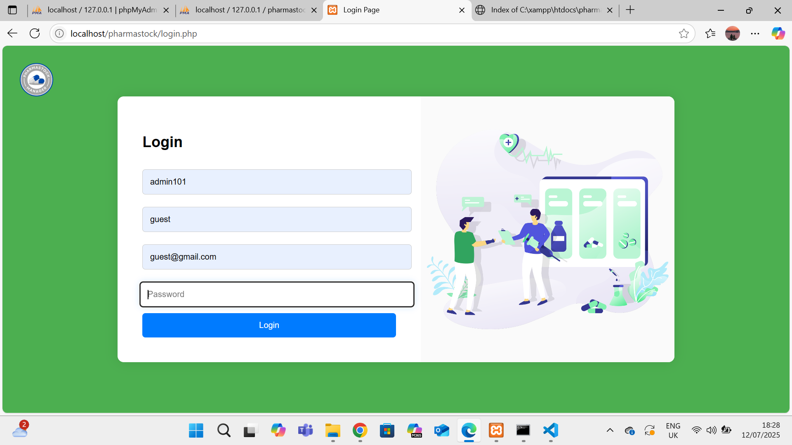

---

### 📊 Dashboard
Displays low stock alerts and monthly sales chart.
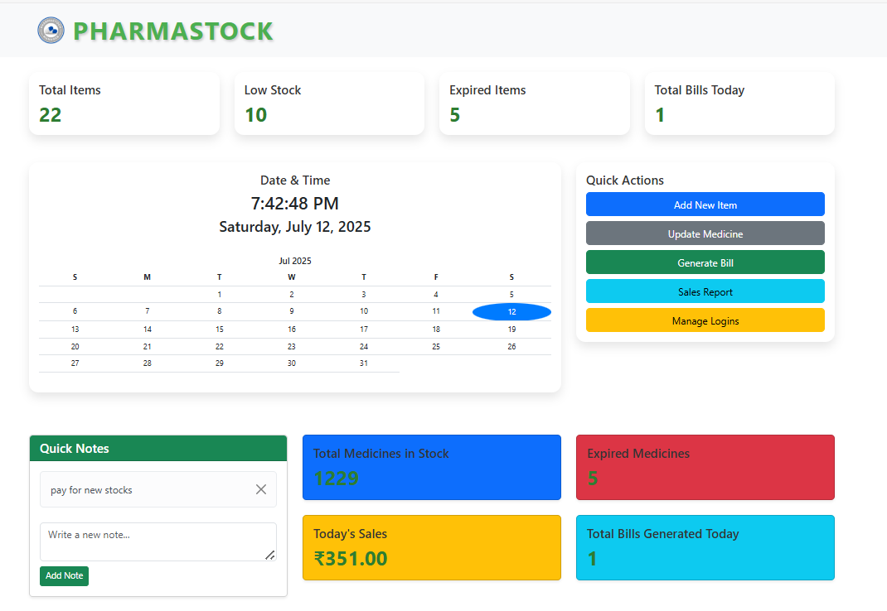

---

### 🧾 Generate Bill Page
Allows users to add medicines to a bill and select payment method.
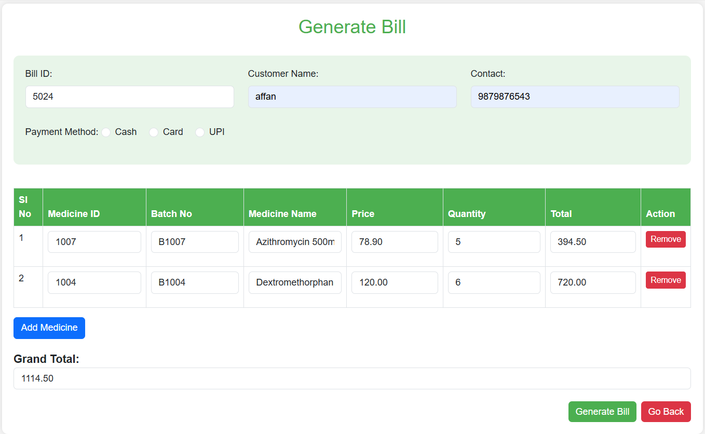

---

### 🖨️ Bill PDF Output
A properly formatted PDF is generated for printing.
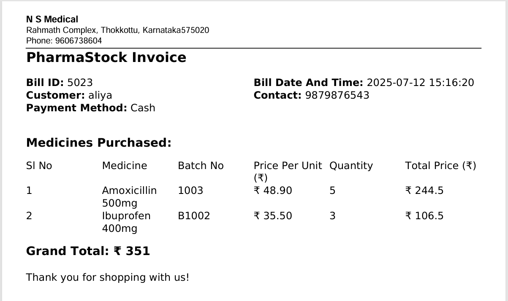

---

### 📈 Daily Sales View
View of sales made in a day with total amounts.
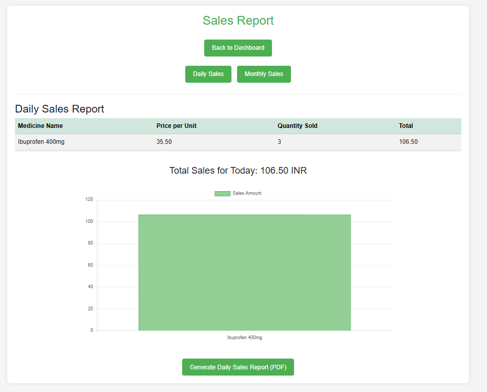

---

### 📉 Monthly Sales Chart
Monthly summary graph to visualize medicine sales.


---

### 📑 Sales Report PDF
Downloadable PDF sales report with bill and medicine details.
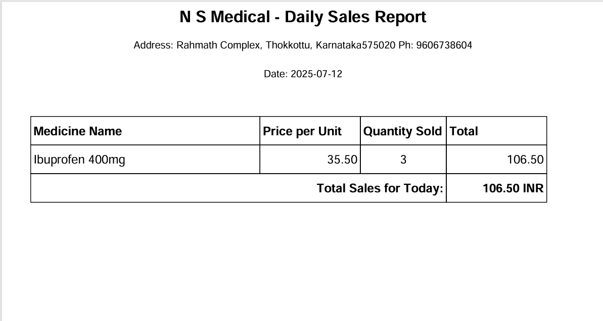

---

### 📦 Add New Medicine
Add new stock entries with supplier and expiry validation.
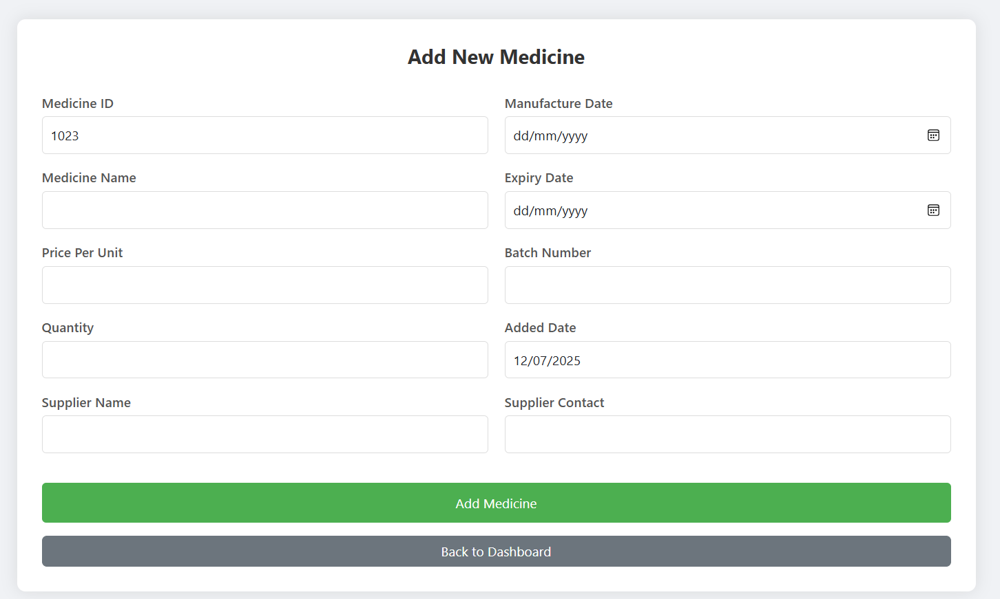

---

### 📝 Update Medicine
Modify medicine details, price, quantity, or expiry.
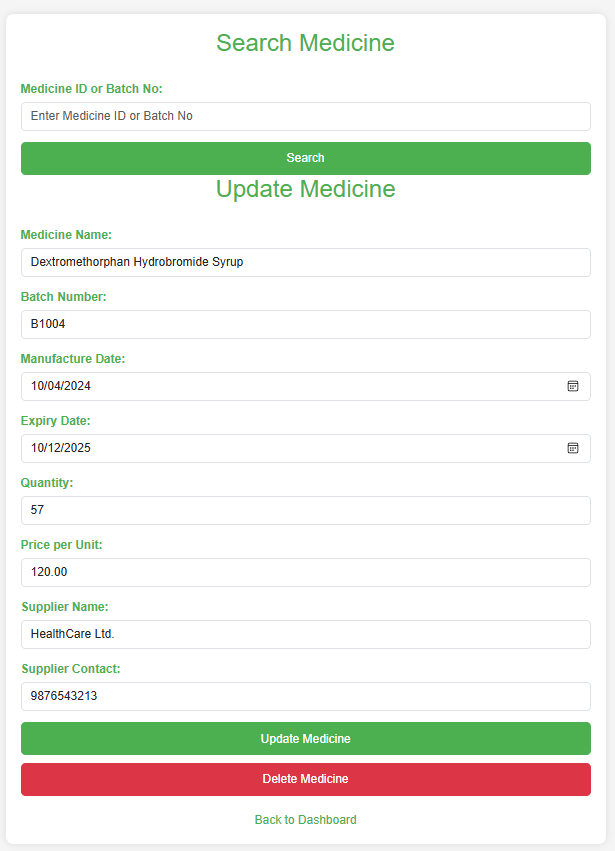

---

### ⚠️ Expired Items Alert
Alerts shown for expired medicines.


---

### 🚨 Low Stock Alert
Displays medicines that are running low and need restocking.
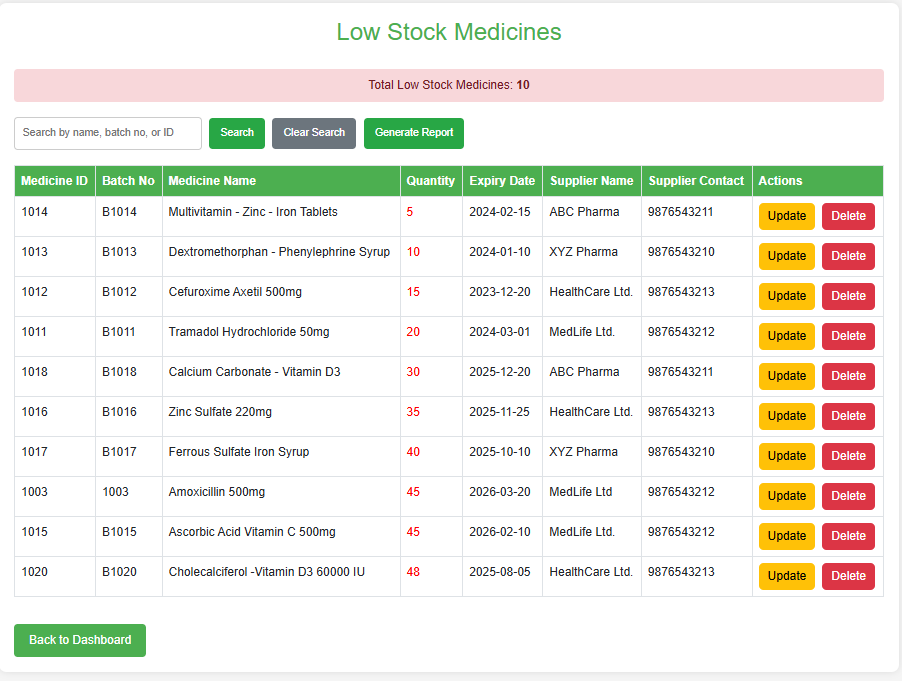

---

### 🧮 Total Bills Summary
Overview of all bills generated by the system.
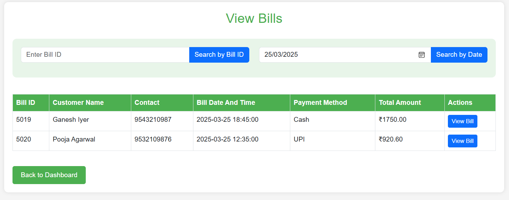

---

### 📋 Total Items Sold
View of sold quantities and income per medicine.
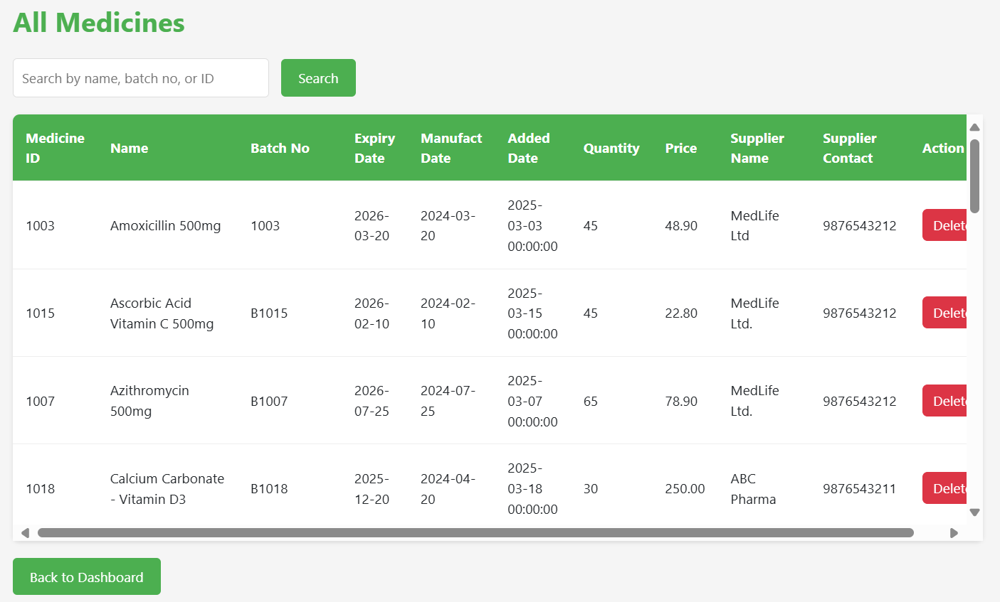

---

### 👤 Manage Users
Admin interface to add, update, or remove users.
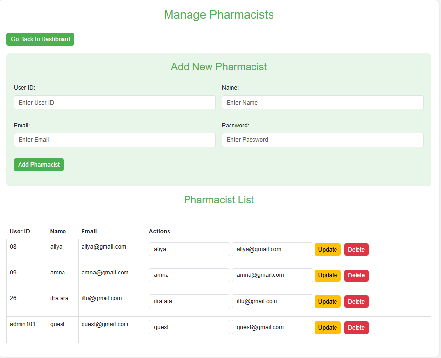

  
📄 License

This project is created as part of an academic course. You are free to use or adapt it for learning purposes.

✨ Author

**Aliya Banu**  
📧 Email: aliya26205@gmail.com  
🌐 GitHub: [github.com/aliya26205](https://github.com/aliya26205)  
🔗 LinkedIn: [linkedin.com/in/aliya-banu26](https://www.linkedin.com/in/aliya-banu26/)

## 👩‍💻 Project Contributors

- **Aliya Banu**  
  [GitHub](https://github.com/aliya26205) • [LinkedIn](https://www.linkedin.com/in/aliya-banu26/)

- **Amna Munawar Ali**  
[LinkedIn](https://www.linkedin.com/in/amna-munawar-ali-7a9292317/)

- **Ifra Ara**  
[LinkedIn](https://www.linkedin.com/in/sheikh-ifra-ara-861290317/)


